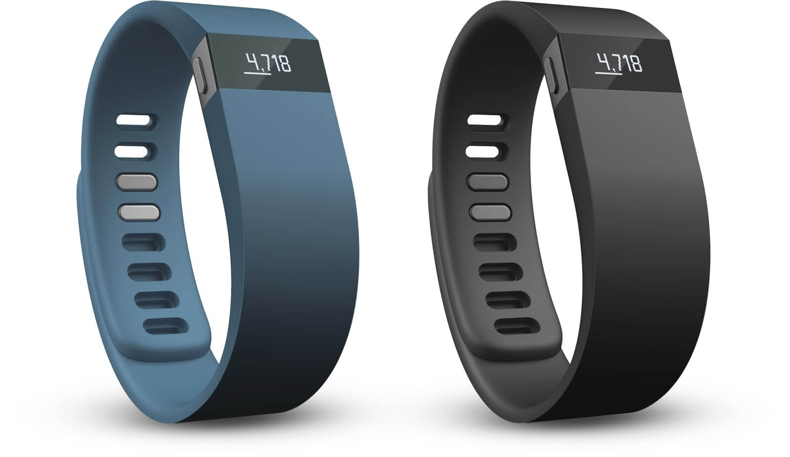

Программист - работа сидячая. И чем больше тебе твоя работа нравится, тем больше ты мнешь свое кресло. И сколько бы раз я не задумывался о том, чтобы сделать свою жизнь более спортивно-активной, все это так и оставалось лишь темой для совместных бугагашек над собственной ленью. Что-то вроде "сегодня у тебя, Лёша, минус один год, как ты пошел в спортзал". А кроме откровенной лени, знаете, если еще и опасения. Вот придешь ты такой в спортзал, оденешься во все спортивное... А дальше что?

Сидели мы с женой как-то дома, и с какого-то немыслимого перепугу решили написать друг другу расписки, общий смысл которых такой: к середине лета вовлечь себя в занятия спортом (любым образом), и добиться определенных результатов. Я для себя-таки выбрал спортзал. И знаете, уже месяц, не считая отпуска, как я туда хожу.

Срок, конечно, сам по себе смешной. Но сам факт, что такая глупость, как расписка, может толкнуть не только на покупку новых кроссовок, но и на регулярное посещение спортзала, для меня полная неожиданность. Первые 4 занятия я занимался с инструктором, который всячески (за приличные деньги, конечно), показывал свою заинтересованность в моем развитии, изучал мой потенциал и давал мне ценные советы. Однако, как только я начал ходить в его смену на занятия обычные, подешевле, стало понятно, что я перешел в разряд "бывших": здороваться со мной необязательно, разговаривать тоже, а в зале меня как будто и не видно :). Смешной дядя.

Кроме всего прочего, возвращаясь с отпуска, что-то нас с Алесей дернуло купить себе по фитнес-трекеру. Странно, что вообще на них деньги остались :). Были сомнения, что это может не сработать, но гик внутри меня уже спел Марсельезу, и в итоге вы взяли себе по одному. Красавцы, правда?

За эту неделю, что мы ими пользуемся, очевидно, что сейчас мы ходим значительно больше. Интерес подогревает и рейтинг, который позволяет мериться, гхм, шагами. Парадоксально, но факт: предлагаешь подвести, а она отказывается. И ей шаги, и мне чистые носки искать не нужно. Идилия!

Радостно, что находятся-таки варианты поднять себя со стула. Вот и сейчас, поедем в кино на метро вместо автомобиля, потому что до метро еще нужно идти минут 15. Полторы тысячи шагов, как-никак.
