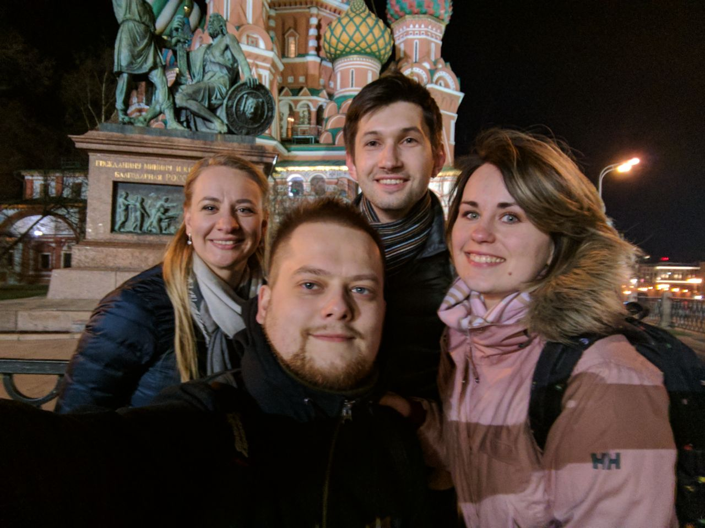

Никогда не любил большие города. Знаю, многих в такие тянет, мол, есть работа, мол, скучать не придется. Отчасти с таким ответом я согласен - спорить трудно. Но лично мое чувство комфорта в таких городах всегда страдает. В этом плане Минск можно назвать городом, приближенным к моему идеалу - я могу оказаться в любой его точке буквально за час. Но из зоны комфорта принято иногда выходить (выезжать, вылетать?), поэтому берем билеты до Москвы и скрещиваем пальцы "на хорошую погоду".

Не особо-то помогло. Тучи, туман, 3 часа дороги из "Жуковского" - и вот мы уже в Сокольниках, с удивлением разглядывая тот самый "Мир кожи и меха". Приехали, стало быть. Можете сказать, что не нужно было лететь в аэропорт в чистом поле, добрался бы быстрее. Это правда, что тут сделаешь. Но ведь интересно же! Только не ищите модный двухэтажный автобус, когда услышите про "шаттл-бас" - это вот та пожилая маршрутка, из поколения П.

И ведь ничего страшного. Дорога воспринимается немного по другому, ведь в этот раз мы поехали не "для чего", а "к кому".

Говорят, Интернет стирает грани, а я скажу, что он строит стены смертной тоски. Люди уезжают жить в новое место за сотни километров, но весь этот информационный груз постоянно напоминает о "тех временах", когда время было беззаботным, а друзья - настоящими. И вот вы уже встречаетесь раз-два в год (если вам чертовски повезет, конечно).

Говорят, Москва меняется. Для меня - нет. Потому что моя Москва - это подземка, несколько монументальных красных зданий в центре да музей Пушкина. Поэтому перемен я не замечаю. Даже вай-фай в московском метро для меня там существовал всегда.

Говорят, обещания встречаться почаще - это все пустое. А вы вспомните про двух-трех своих друзей, напишите им, позвоните. Авось сработает.

