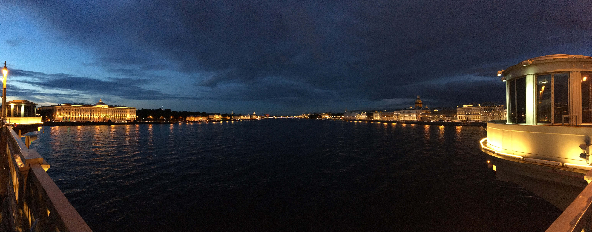

7 утра. Мой персональный рекорд. Так рано в спортзал я еще не ходил. Конечно, я там был не единственный, и даже не первый. Минск просыпается раньше, чем я думал.

Цель - убить сразу двух "зайцев": и тренировку не пропустить, и в Питер попасть.

Питер - это отдельная тема. Он вроде и мокрый, и холодный, и кое-где даже неприлично грязный, и все равно к себе тянет. Вместе с супругой, это они на двоих соображают.

Если кто будет лететь из Минска, знайте: багаж теперь выдают на первой линии, в противоположном конце коридора, отгороженного двумя стенами. Вы никогда этого не узнаете, если будете ждать Минск в списке на ближайшем табло. Он там не появится.

Так что я там про дожди? Ах да, сейчас они тут, похоже, на своих правах. И спасти могут, наверное, лишь резиновые сапоги. Ведь сидеть в комнате сложа ноги - это не вариант.

Ходить тут классно. Мне нравится идти по улице, и видеть, что прямо напротив тебя стоит очередное великолепие вроде Исакиевского собора. Браво архитекторам за такие акценты.

Завтра в Перегроф.
