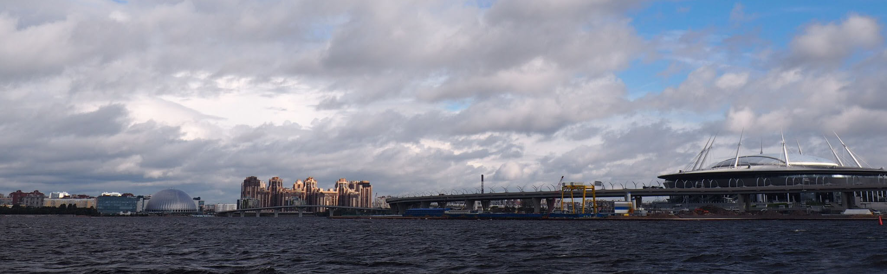
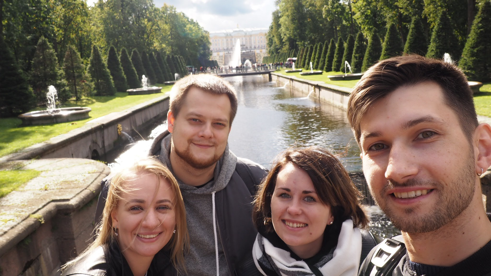

Я давно мечтал прокатиться на Метеоре. Он мне казался особенным видом перербуржского транспорта, стремительным и быстрым, пусть и недешевым. И ожидания мои оправдались.

Конечно, он стоит 800 рублей, а не 70, как маршрутка. Но разок-то можно!

Непередаваемое словами ощущение, когда ты стоишь на палубе, и ветер тебе начинает задувать так, что невозможно смотреть вперед. Нет ни светофоров, ни поворотов, он просто плывет, и это совсем другие 60км/ч. Но вот ты возвращешься в салон, садишься на место у окна, и одеваешь солнечные очки: нежданное солнце, отражаясь он невысоких волн, дает тебе приятное ощущение жаркого лета.

До этого мы уже были в Петергофе, но начинали свой обзор с Верхнего сада. В этот раз мы основательно прошлись по Нижнему парку. Туристов было не очень много (видимо, основная масса должна была приехать вечером, на спектакль), что позволило нам неспешно и без дискомфорта обойти его практически полностью.

Как и многие, мы посмотрели прогноз погоды, и готовились к дождю на целый день, но weather.com нас обманул, на что мы, конечно, не обиделись. Промелькнула мысль, что лучше смотреть местные каналы, нежели иностранный ресурс, ибо они далеко, а мы вот здесь.

Интересное, конечно, на этом не закончилась: нам предстояла проверка наших ног на прочность, вернувшись на Невский, к дому Зингер, к Спасу на Крови, и другим достопримечательностям.

Центр Питера этим вечером был необычно тихим, а диван - особенно мягким.
