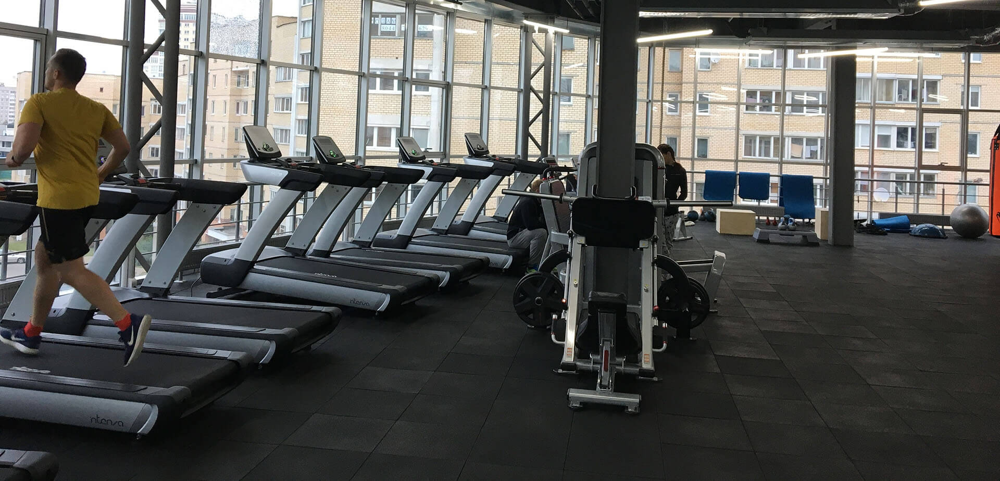
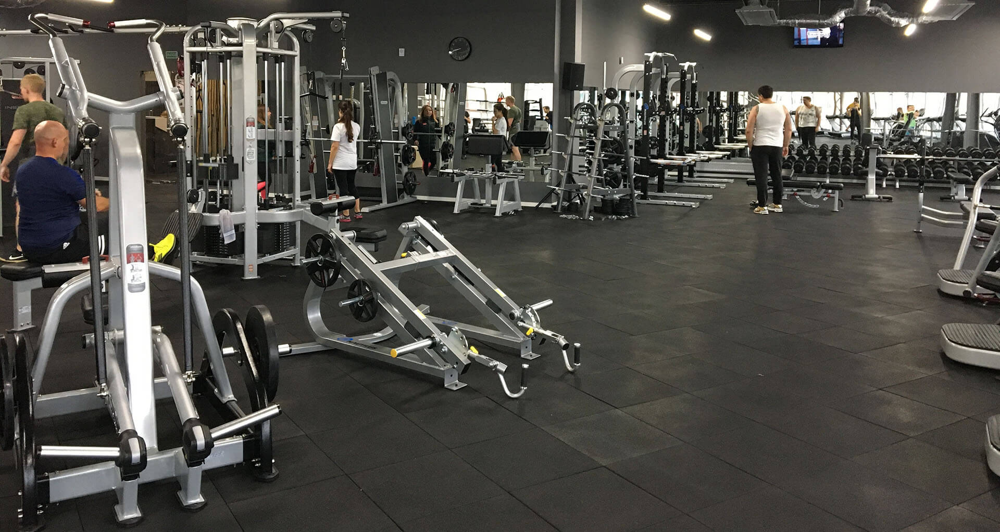

Сегодня я наконец посетил новый ("третий", как любят тут говорить) фитнесс-клуб Sportfamily, что в Уручье, на третьем этаже ТЦ "Спектр". Сказать, что его открытие было ожидаемым - ничего не сказать. Думаю, что каждый, тренировавшийся в "первом", ждал этого момента, и волнение это было приятным.

По факту же, мое впечатление оказалось смазанным.

Началось все с парковки автомобиля около торгового центра. К сожалению, SF не подготовился к этому никак. Ситуация просто катастрофическая. Вы только представьте: 8 часов утра, а на парковке, у тротуаров и даже во дворах нет свободных мест. Но если осмотреться, понимаешь, что удивляться нечему:

* Кто-то еще спит и не уехал;
* Кто-то уже приехал на работу (например, в сам ТЦ или в БЦ "Порт" напротив);
* Ну и конечно же, основная масса приехала к метро, кинула авто, и уехала.

Что уже говорить про посетителей спортивного зала. Летом, конечно, можно и прогуляться, но зимой люди будут либо крутиться по 15-20 минут вокруг здания, либо не поедут в зал вообще.

Ничего, место все-таки нашлось. Пришел на ресепшн. Просторно и симпатично, хоть и нелюдно. Даю свой абонемент... и не получаю его обратно. По новым правилам, он теперь должен храниться до тех пор, пока ключ от шкафчика не будет возвращен. Я не верю, что никогда не возникнет путаницы, поэтому лучше номер своего абонемента запомнить.

Беру ключ, захожу в раздевалку - светлую и просторную - и понимаю, что мне выдали ключ от нижней полки. Причем сложилось впечатление, что ключи выдавали строго по очереди, потому что я, №10, толкался плечами и делил одну скамейку с №9 и №11, так что на первых порах, похоже, это контролировать самому. SF, не делайте так больше.

Зал, очевидно, стал в два раза больше, чем предыдущий. Очень стильный, и напичканый новенькими тренажерами. Одна из "фишек", которую многие ждали - это длинный ряд беговых дорожек напротив панорамных окон. Дорожки оказались классными. Были некоторые опасения, что находящееся напротив кладбище будет портить впечатление, но, могу сказать точно, что до того, как деревья не потеряют свою листву, все будет хорошо.

Я недостаточно спортивный для того, чтобы кто-либо прислушивался к моей оценке оснащенности зала, но уже достаточно смелый, чтобы носить майки без рукавов. И сначала мне показалось, что в этом зале есть все, и даже больше. Но после пяти минут внимательного изучения, я заметил, что нет двух важных атрибутов первого SF:

* Стоящего в центре зала тренажера "Бабочка";
* Шведской стенки для занимающихся кроссфитом.

Но черт с ней, с "Бабочкой", у меня есть прекрасный тренер, который подскажет, чем ее можно заменить. Для моя личная драма состоит в том, что мой наставник - это крутейший тренер по кроссфиту, и я даже не уверен, что он и дальше будет работать в этом зале, так как места для его снарядов в этом зале нет. Зато боксерский ринг есть, чо.

Я без стеснения могу сказать, что последний год моего посещения Sportfamily меня изменил, как в физическом, так и в моральном плане. И что теперь будет дальше, покажет только время. И решения администрации, конечно.
