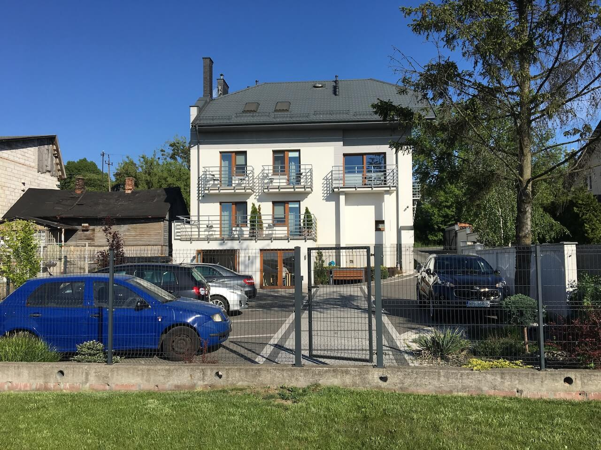
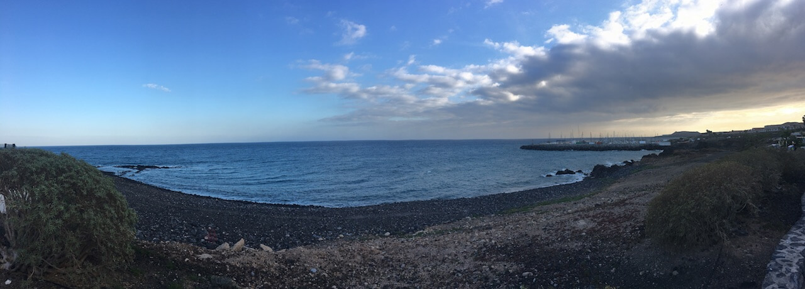

Я люблю свою работу. Мои коллеги подтвердят. Поэтому, когда ввиду определенных обстоятельств оказалось, что я не смогу уйти в отпуск на протяжении года, я не очень расстроился. Подумаешь, сколько той зимы! Однако, предыдущая поездка (а летали мы на Тенерифе) оказала на меня сильное влияние. Думаю, незаметно для себя мне пришлось пройти через 5 знаменитых стадий, включая принятие того факта, что раньше я все равно никуда не уеду.

Но я дождался. Маршрут построен.

И вот уже девятый час утра, мы мчимся по бресткой трассе в направлении Модлина. Настроение бодрое и с надеждой на быстрое прохождение границы (будний день же) и впереди планы на плодотворно проведенный отдых. Жаль только, что 8 мая оказался выходным у поляков, из-за этого наша дорога оказалось растянутой на 11 часов (включая очереди после (!) прохождения границы и непонятные пробки на ровном месте). Спасибо Белавиа, что делаешь нашу жизнь ~~короче~~ ярче!

Стоит ли говорить, что ночью я спал крепко. Вообще, бронируя номер, я переживал, что железная дорога рядом нам будет мешать. Но оказалось, что все окна выходят на местную речушку, и плотно закрываются. Но это только на ночь, потому что столько птичьих перезвонов сразу я уже давно не слышал.

И вот он, день П, с шестичасовым перелетом Ryanair, который, как оказалось, в последний год берет деньги даже за чекин на соседних креслах. А вообще, я, конечно же, считаю, что лоукосты это просто прекрасно. Если летишь ненадолго или один :). Интересным фактом для меня оказалось то, что пассажиры достаточно активно тратили деньги на борту (духи, лотереи, еда, само собой). И в самом деле, на нашем рейсе бортпроводники были весьма учтивы только в случае, если ты им протягивал свою кредитку. В общем, пять кокобаев, и все пилоту.

Остановились мы в том же месте. Долго выбирал я разные варианты, и понял, что среди всех недостатков (очень удачно совпадающих с многочисленными платными услугами, включая wi-fi) есть нюансы, из-за которых стоит вернуться. И апартаменты даже похожи. Потому что ностальжи.

Я не питаю особых иллюзий по поводу того, сколько всего нового я смогу посмотреть в этот раз. Знаете, я из тех людей, что, случайно оказавшись в Париже, вряд ли полезут на Эйфелеву башню. Поэтому, попаду ли на вершину вулкана Тейде - это еще открытый вопрос. Но что-нибудь новое для себя я тут точно открою.
