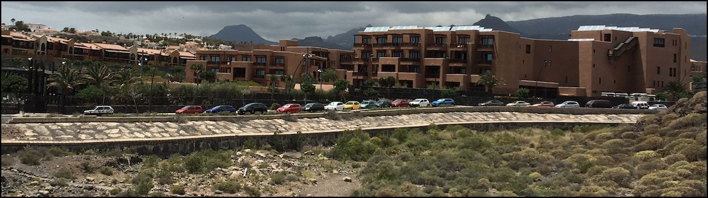

Я увлечен автомобилями. Увлечен по-простому, как потребитель, не механик. Началось это на втором курсе университета, когда я заметил за своим приятелем Денисом, что он запросто может пропустить красивую девчонку, идущую навстречу, а вот новую мазду "троечку" - никогда. Я еще тогда начал подшучивать над ним, но для себя впервые в жизни отметил, что "двоечка" посимпатичнее будет. Как впоследствии оказалось, с моим ростом туда поместиться сложно, но фундамент был заложен, и я за компанию стал отмечать интересные автомобили на дороге.

С тех пор, на мой скромный взгляд, автомобильный рынок в Беларуси стал достаточно скуден. Как говорится, "Бери что дают". И оттого больно смотреть, как любимые мною "хэтчи" и всякие симпатичные мне псевдокроссоверы обходят наш рынок из-за дюжины-второй однотипных седанов, выпускающихся в РФ.

Но в Европе я кайфую, здесь есть на что посмотреть и что попробовать.

В прошлом году я взял в аренду Opel Astra GTC. Зверь в Беларуси не сильно и редкий (успели наввозить), но кроме симпатичности он больше ничего не смог дать. Дороги на Тенерифе часто с большими уклонами, а автомобиль оказался черезчур тяжелый для базового двигателя. И вот ты боишься свернуть направо всякий раз, когда попадается большой уклон. Вуаля!

Напуганный тенерифофскими серпантинами, я решил попробовать другого, не менее симпатичного мне зверька: Opel Adam. Это маленькая и юркая машинка, которая должна была побороть все недостатки предшественника, особенно с учетом того, что я выбрал модификацию Rocks (ради большей мощности и люка). И все действительно было замечательно, пока я не отметил одного, увы существенного, нюанса.

Серьезных ветров вблизи побережья.

Сначала я не придал этому значения, больше заботясь о том, как мне покомфортнее усесться внутри, но через некоторое время я и сам, в дополнение к отзывам госпожи А., стал обращать внимание, что эту бибику на трассе порой так шатает, что становится волнительно. Поэтому через пару дней мы решили ее поменять.

А я и рад. Что скрывать, у меня есть своеобразный список авмобилей, которые, с моей точки зрения, достойны теста. А поскольку в минских автосалонах большинства автомобилей в наличии просто нет, то и отнекиваться не за чем.

После непродолжительной беседы с прокатным агенством мы нашли то, что меня устроило: Volvo V40 T2. Не Cross Country, конечно, но тоже мне симпатичная. Ожидания - комфорт и достаточная мощность, чтобы уверенно чувствовать себя на дороге - полностью оправдались. Несмотря на младший в семействе двигатель, кстати. В Беларуси такие тоже присутствуют, поэтому, если вам нравятся стильные хэтчи, я рекомендую.

И что приятно, судя по поведению местных, строгость местных правил дорожного движения компенсируется... ну вы поняли.
