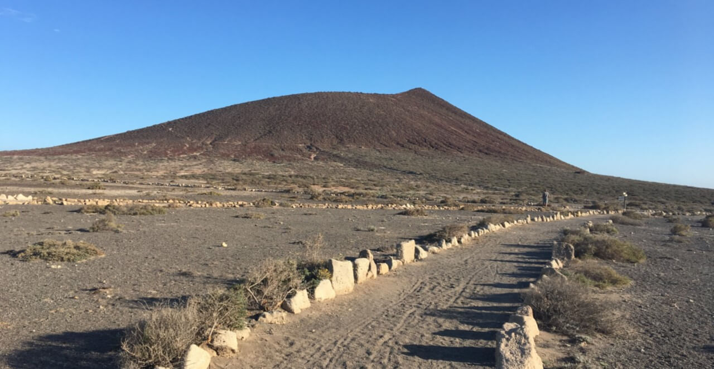
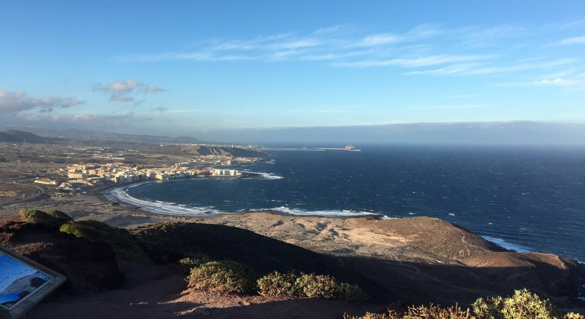
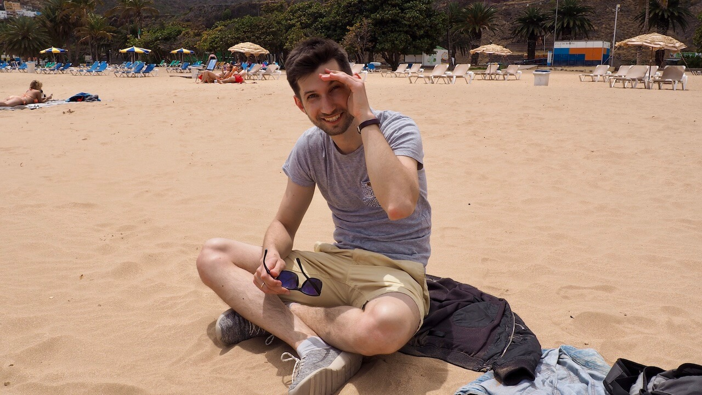
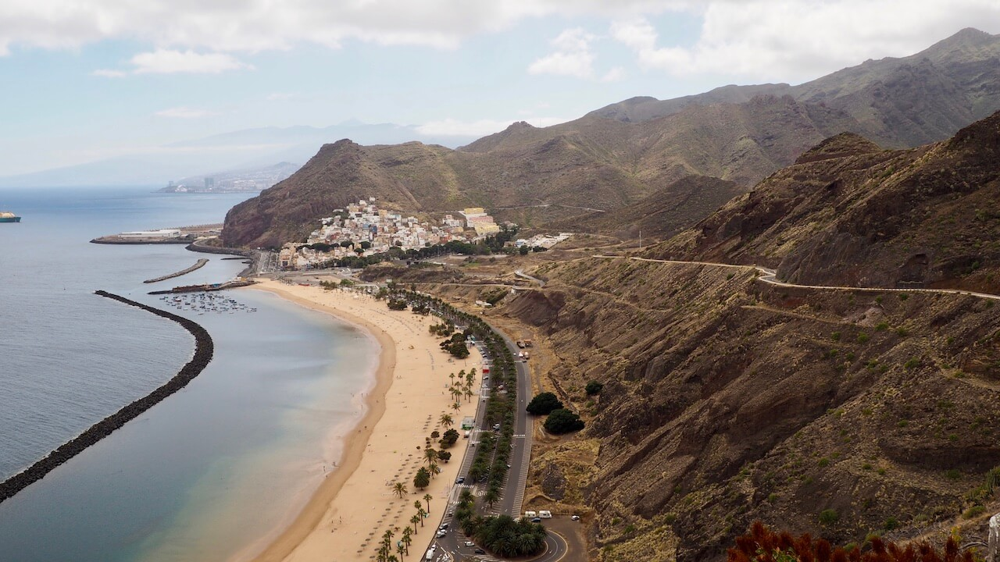
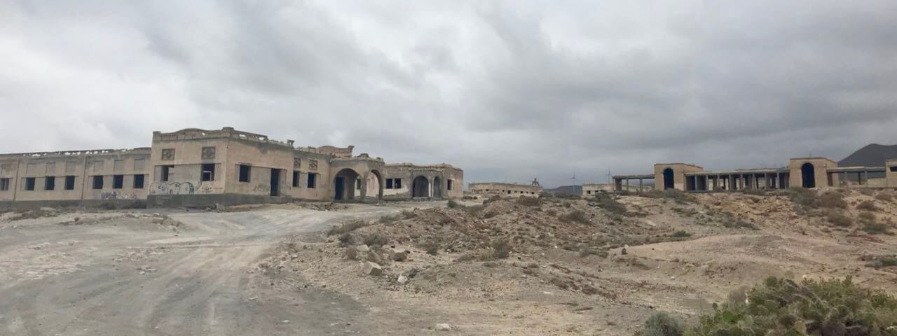
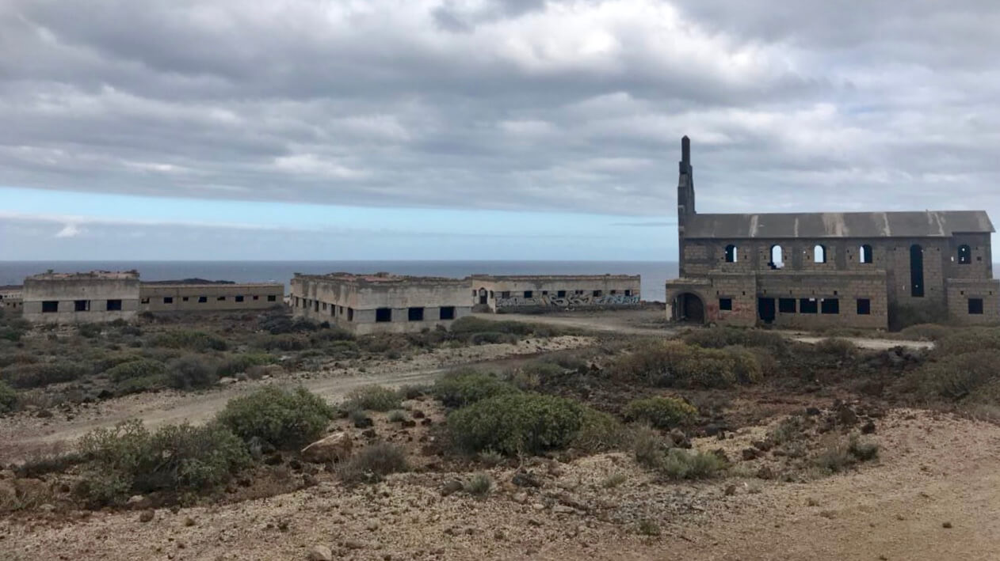
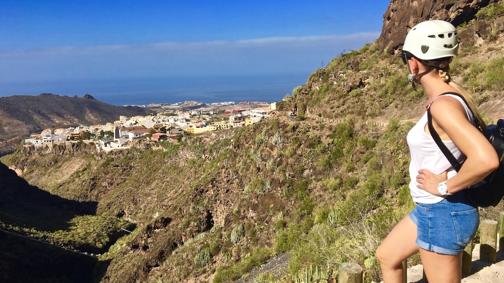
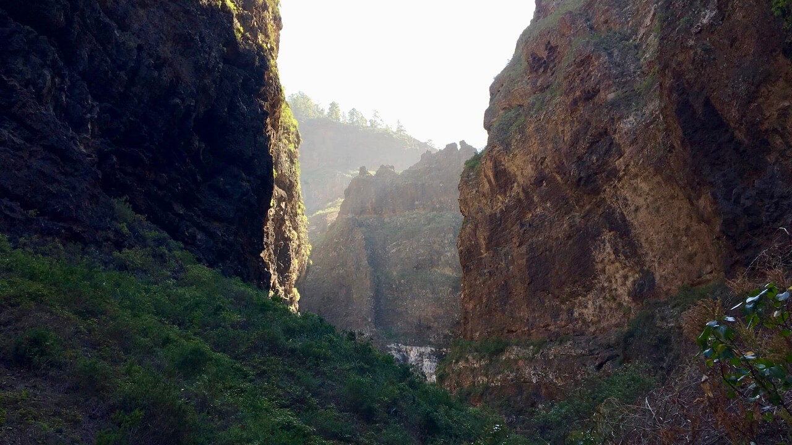
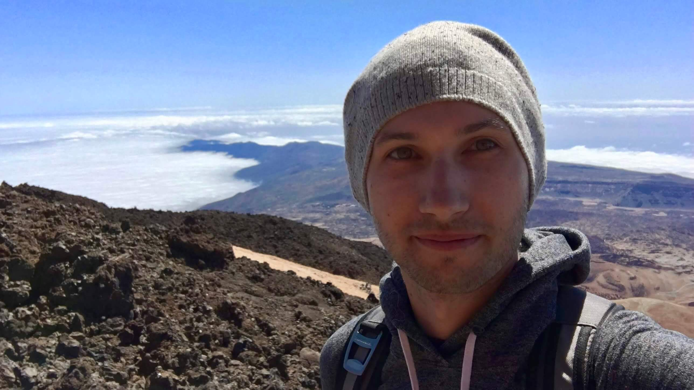
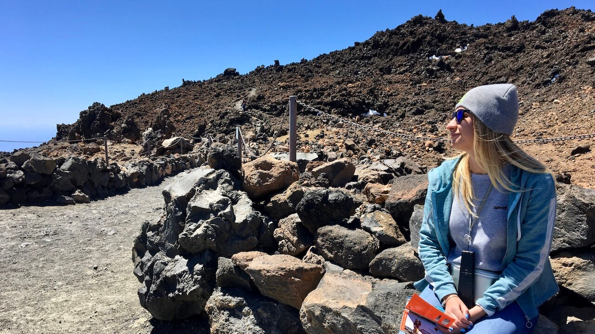

У меня никогда не возникало особого трепета при виде гор, скал и тому подобных вещей. Боюсь высоты. И глубину не люблю. И вообще, мне подавай что-нибудь зеленое и ровное (здесь должна быть шутка про картофельное поле). Но отдыха иногда слишком много, и эту скопившуюся энергию хочется потратить. По счастливой случайности, больше всего я люблю ходить и разглядывать. Кажется, сейчас это называется хайкингом. Масштаб, конечно, не тот, но кое-что интересное разглядеть на Тенерифе мне все же удалось.

## Montana Roja

Эта гора всегда была у нас на мушке. В прямом смысле, мы ее прямо из гостиницы видели. Издали она кажется весьма высокой (хотя это не совсем так), до ее подножья легко добраться на автомобиле, а сверху открывается отличный вид на океан и городок Эль-Медано, где обучают кайту и серфингу.

Где-то среди отзывов вы можете встретить слова "средний" и "просто". Но не расстраивайтесь. Вы легко можете повысить уровень сложности, взойдя на гору при сильном ветре, как это сделали мы.

## Playa de Las Teresitas

Это один из самых популярных пляжей острова, на котором вместо черного вулканического песка лежит желтый африканскай песок, который везли из Сахары специально для того, чтобы повысить ценность острова для туристов. Пляж достаточно длинный, с огромным количеством парковок, лежаков и и другой инфраструктурой. Место защищено волнорезами, поэтому океанские волны почти не добираются до берега и не вымывают ~~вас~~ песок с пляжа.

## Abades

Для незнакомых судьбой жителей острова Абадес - лишь маленький городок на юго-востоке Тенерифе. Тем не менее, в начале сороковых там строился лепрозорий для размещения больных проказой, с целью уберечь остальных жителей острова от этой болезни. По счастливой случайности, лекарство было найдено раньше, чем стройка закончилась, и реально там никто никогда не жил. Однако здания сохранились, и прогуляться по этому необычному месту можно совершенно свободно.

## Barranco del Infierno

Под грозным названием ("Адское ущелье") скрывается живописный заповедник, в конце своего пути который демонстрирует единственный источник пресной воды на острове - водопад. Прогулка по ущелью достаточно безопасна и изобилует прекрасными видами. Имея удобную обувь и достаточное количество воды вероятность получить удовольствие от прогулки весьма высока!

## Teide

На вулкан можно попасть как пешими маршрутами, так и с помощью специально построенного фуникулера (который, по понятным причинам, пользуется большим спросом). Везет он не до самой вершины, но и оттуда, на высоте трех с половиной километров, открываются умопомрочительные виды на остров, океан и облака, находящиеся под тобой. Хочу отметить, что перед подъемом есть возможность арендовать аудиогид на русском и узнать немало нового о самой высокой вершине Испании.

Среди прочих, есть на Тенерифе одно популярное развлечение, и связано оно с трехчасовым спуском по ущелью от деревни Маска. К сожалению, нам не удалось туда попасть ввиду того, что тропа был закрыта для посещения. Причиной стал инцидент, произошедший с группой туристов, которые, несмотря на оранжевый уровень опасности и сильный ветер, [все же решились на спуск](http://walkingtenerife.co.uk/why-masca-barranco-had-to-be-closed.htm). Но поверьте, при таком количестве альтертатив для отдыха, которые имеются на острове, скучать вы не будете.
