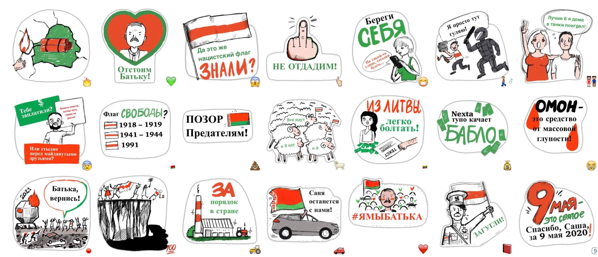

Вчера многие жители моего района стали свидетелями так называемого "мини-движения" за действующий режим: в Новую Боровую приехала колонна автомобилистов, и под мотив песни "Саня" колесили взад-вперед без номеров. Зрелище любопытное, ведь мы сейчас наблюдаем, по сути, "пост-выборную" кампанию А. Лукашенко, потому что предвыборной, как таковой, не было (если не считать знаменитое турне по войсковым частям).

Примечательно, что запуск ее (кампании) произошел в один момент. Буквально. Будем честными, пропаганда никогда не была сильной стороной правительства, работая лишь проверенными советскими методами на аудиторию из электората 90-х.  За прошедшее время успело вырости новое, невосприимчивое к этому поколение людей, а их родители, в значительной части, смогло поездить по миру и посмотреть, как на самом деле бывает.  Резко появившийся Telegram-стикерпак "[zabelarus](https://t.me/addstickers/zabatku)", наряду с откровенно провокаторскими видеосюжетами на телевидении и санкционированных парадов и велопробегов недвусмысленно намекает, что без помощи не обошлось. В конце концов, идеологи не покемоны, которые могут внезапно эволюционировать. В то же время, развитие, которое мы наблюдаем, в некотором роде похоже на поведение российской пропаганды: здесь и наводнение ботов в соцсетях, и разрисованные краской автомобили, и "Белоруссия" из экранов белорусских телепередач. 

*скандальный стикерпак*

Лукашенко можно понять. На фоне подлога на выборах и беспрецедентной жестокости во время разгона мирных демострантов поднялась огромная волна протестных и забастовочных движений. По своей силе это похоже на попытку импичмента 96-го года, хоть и идет не со стороны элит (сверху), а со стороны народа. Средства используются похожие: точечное (правда, в данном случае, массовое) давление на работников предприятий. Параллельно происходят попытки "размыть" повестку и отделаться малыми уступками. Многие этот подход знают, ведь сделать хорошо человеку очень просто, вернув отобранное. Например, выпустив избитых и искалеченных людей из тюрем, извиниться и сделать видимость проводимых расследований.

Исторически, Лукашенко мало волнует мнение Запада, и персональные санкции он пропустит мимо. Куда важнее экономические последствия: судя по всему, мы будем наблюдать тренд к ограничению количества мировых кошельков, которые захотят предоставлять кредиты, даже под большие проценты. Вся банковская система Беларуси уже дискредитирована с момента вмешательства в дела Белгазпромбанка, а наловчившийся со времен Прокоповича народ умелой рукой купил "американские и европейские яхты" на все рубли и переложил их в банку стеклянную. Это усиливается отсутствием спроса на государственные облигации, в то время как частный бизнес и IT сектор оглядывается по сторонам, прикидывая, как и куда можно с минимальными потерями перевести сотрудников (что еще сложнее на фоне коронокризиса и ограничений на перемещения по миру).

Вертикаль защищается, и по привычке - нападением. Недавно созданному [Координационному Совету](https://rada.vision/) уже предъявлены обвинения по уголовной статье, а на предложения других стран в медиации процесса переговоров поступает встречное предложение "сначала разобраться у себя". 

Ситуация развивается стремительно, и в этом, кажется, нет ничего удивительного, учитывая тот факт, что воля народа подавлялась на протяжении 26 лет, что представляется определенным катализатором: воспитанные призывами быть смирнее и терпеть беларусы это самое терпение, похоже, потеряли. 

Как мы все знаем, есть лишь два способа заставить человека делать то, что нужно другому: личная заинтересованность и страх. Остается лишь наблюдать, сколько белорусских рублей будет напечатано и сколько приговоров / увольнений произведено в попытке повернуть время вспять.