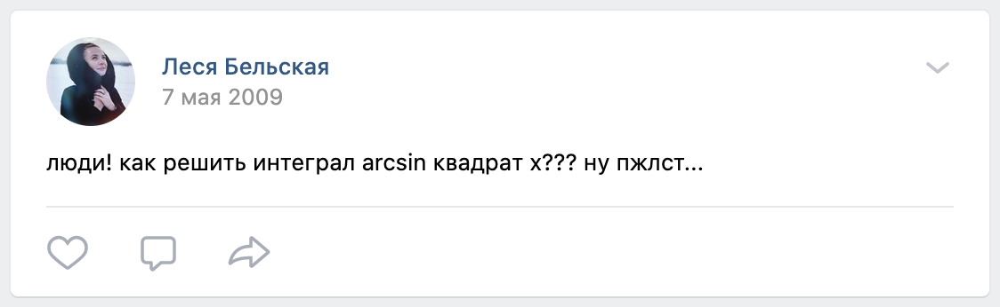

В недавнем ["обращении преподавателей и сотрудников БГУ против лжи, насилия и беззакония"](https://www.facebook.com/epramovaorg/videos/680819875885204/) среди прочих я увидел выступление доцента Ольги Зубко. Во времена моего студенчества она вела на нашем потоке практические занятия по высшей математике. И пусть за последние 10 лет предмет уже прилично выветрился у меня из головы, однако события, косвенно связанные с "вышкой", я буду помнить до крайней степени деменции. 

## История 1: Шанс
БНТУ - университет широкого профиля, и кадры там работали абсолютно разные. По медиане - регулярное посещение и защита промежуточных работ вовремя это то, что  обеспечивало безболезненную сдачу зачета или экзамена.  Но в случае с высшей математикой с нас справедливо спрашивали понимание предмета, и поэтому процедура получения экзамена "автоматом" была несколько сложнее.

В течение семестра в нашем потоке проводилось несколько контрольных, успешное написание каждой обеспечивало доступ к так называемому "коллоквиуму" - промежуточному теоретическому экзамену, положительно влияющему на экзаменационную оценку.

Я считал себя неплохим практиком, но с зубрежкой у меня всегда были проблемы.

Сразу после одной из таких контрольных я заболел пневмонией, и, понятное дело, уже  ни на что не рассчитывал, так как сил что-то учить было по нулям. В один из этих неприятных дней, в день моего рождения мне написала Ольга (что само по себе было необычно), и поздравила меня. Еще она сообщила, что контрольную я написал *паршиво*, но за предыдущие заслуги она решила допустить меня к коллоквиуму, что было очень щедрым авансом с ее стороны.

Мораль: у каждого в жизни есть экстремумы. Дать шанс, не отсекая по нижней границе - благородный поступок, который может помочь снова поверить в себя и вернуться в строй. 

P.S. Коллоквиум я тоже провалил, кстати.

## История 2: Виноград
Ужины в общежитии редко отличались разнообразием, и в целом меня это никогда не расстраивало. Но если появлялся шанс, я его не упускал. В один из дней Максим №1 (я жил в комнате с двумя Максимами) принес огромную гроздь винограда. Было очевидно, что ему она была не под силу, и мы всей комнатой включились в процесс. Виноград был вкусный, крупный и без косточек. Не стоит сомневаться: виноград этот мы "умяли" быстро. Я был очень молод, и был практически уверен, что в состоянии переваривать даже гвозди. 

Дело происходило намедни одного из экзаменов, но связи между виноградом и важными событиями в жизни я еще ни разу не встречал. 

Двадцать минут после начала я понял, что время играет против меня, и у меня нет тех полутора часов, что были нам отведены. 

Еще 10 минут спустя я понял, что не смогу вернуться быстро, а стать героем мемов мне не хотелось. 

Была выбрана тактика "Я очень спешу". За половину отведенного времени было решено все, что поддавалось механическому решению, потому что голова была занята  в основном вопросами сохранения чести и достоинства. Впоследствии я узнал, что воспользовался законом Парето, не подозревая о нем.

Мораль: выходить и быть выведенным из зоны комфорта порой просто необходимо, только так можно узнать себя лучше.

P.S. За экзамен я получил 7 из 10.

## История 3: Интеграл
Механике расчётов на практических занятиях отводилось большое значение: зная несколько из них, можно было находить эффективное решение довольно быстро. Тогда я еще помнил, что такое интеграл и зачем он нужен.

Одной из таких методик был разбор интеграла по частям. Доказывая свои знания, мы исписывали тетради, поэтому неудивительно, что я был "заряжен": интегралы мне разве что не снились. Это были времена, когда Дуров еще не убрал стену, и в моде были статусы (сейчас это что-то вроде сториз). В процессе просмотра новостей я увидел крик о помощи:

На тот момент я не знал ни кто эта девушка, ни как она оказалась у меня "в друзьях", но я точно знал, что нужно делать. Решение выменял на 🍊 мандарины. На тот момент у Алеси еще была другая фамилия.

Мораль: знание подходов может дать вам больше, чем вы рассчитываете.

---

Я не верю в гороскопы, но не верить в эффект бабочки не могу. Желаю Ольге Леонидовне семейного счастья и карьерных успехов. Если вам вдруг понадобится ее помощь, то, как выяснилось, обратиться к ней можно как минимум через [образовательный центр "MaxPrime"](http://maxprime.by/our-teachers/olzubko/).