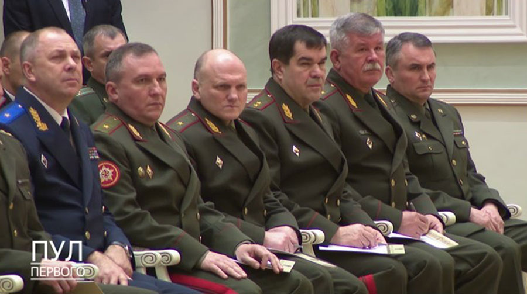
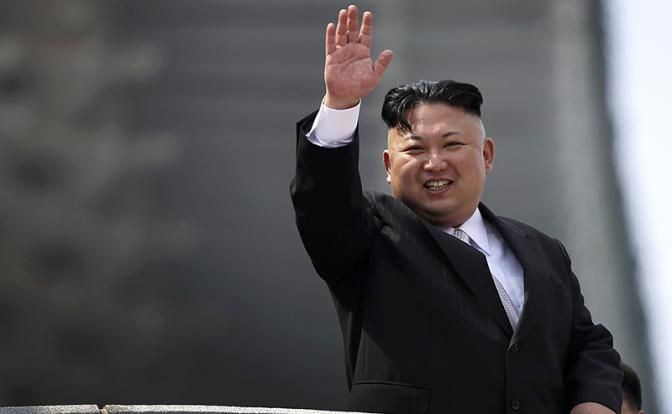

За последнюю неделю мы услышали множество заявлений от гражданина Лукашенко. Что бастующих студентов нужно отчислять, а рабочих, врачей и преподавателей - увольнять, не оглядываясь на опыт и заслуги[^1]. Что пришло время создавать вооруженные народные дружины из числа бывших офицеров[^2]. Что дипломы зарубежных вузов не должны приниматься во внимание[^3]. С другой стороны, как Верховный Главнокомандующий, он пытается развлекать свою подолгу сидящую на стульях аудиторию в погонах, придумывая (как бы между прочим) прозвища оппонентам[^4].

Человек, который хочет быть и страшным, и смешным. 

Пленных больше не берут (в Беларуси война?), а за "прикосновение к военнослужащему" недурно бы и в принципе лишать рук (а ведь в худшие времена для этого нужно было хотя-бы что-нибудь украсть...)[^5].

Параллельно мы успели наблюдать за тем, как закрываются границы на въезд для белорусов[^6], как закрывают проявившие солидарность рестораны[^7], как чистятся ряды студентов и трудовых коллективов, и даже как назначаются советники из числа военных[^8]. Еще в почете, но, правда, уже без войска.

Один страшно популярный в свое время вождь сказал: "Своим - все, чужим - закон", но если на секунду представить, что свои - во дворце, а чужие - это люди на улицах, то окажется, закона даже для них уже давно не осталось. К тому же, непонятно, чего сейчас в воздухе больше: пропаганды или провокации.

Это очень напоминает тактику выжженной земли, когда, отступая, ты не оставляешь сопернику ничего, чем бы он мог воспользоваться. Работает, когда у самого кое-чего еще имеется. Запрещена лет 40 тому назад, нечеловечно. Однако, похоже, что вопрос "А что потом" на повестке не стоит. Вероятно, вопрос уже для следующей пятилетки.

Так и экономика, всеми силами пытается казаться, а не быть. С точки зрения Нацбанка, нет инструментов кредитования - нет искушения народа в покупке соседних валют. Границы ведь закрыты, зачем им. Это отчасти так, но все мы знаем, что происходит, когда волчок перестает крутиться. Он падает и самостоятельно завертеться больше уже не может.

А тут еще и те, кто раньше тратил в "Акрополисе" или "Аркадии" 10% своей денежной массы, стали зарабатывать ее прямо на месте[^9]. Никаких тебе многочасовых утомительных поездок, забитых поверху машин и очередей за визами. Одни плюсы.

Шутки и сравнения с Северной Кореей сейчас весьма уместны. В конце концов, появление главного человека за трибуной в обоих случаях вызывает слезы. С искренностью, правда, перевес на стороне блистательного Маршала. 

[^1]: [Лукашенко поручил не уговаривать бастующих и отчислять студентов](https://soyuz.by/politika/lukashenko-poruchil-ne-ugovarivat-bastuyushchih-i-otchislyat-studentov)
[^2]: [Лукашенко предложил создавать вооруженные народные дружины «для защиты своих домов»](https://meduza.io/news/2020/10/29/lukashenko-predlozhil-sozdavat-vooruzhennye-narodnye-druzhiny-dlya-zaschity-svoih-domov)
[^3]: [Лукашенко: дипломы иностранных вузов не будут признаваться](https://citydog.by/post/zaden-students-29/)
[^4]: [Лукашенко назвал Латушко «лахушкой» и рассказал про «раздрай» в оппозиции](https://news.tut.by/economics/706106.html)
[^5]: [Лукашенко: С сегодняшнего дня мы в плен никого не берем](https://reform.by/175905-lukashenko-s-segodnjashnego-dnja-my-v-plen-nikogo-ne-berem)
[^6]: [Лукашенко закрыл границы?](https://www.dw.com/ru/kogo-puskajut-v-belarus-i-chto-proishodit-na-granice/a-55451353)
[^7]: [«Это огромные убытки, и по-человечески очень мерзко». В Минске закрывают десяток заведений](https://afisha.tut.by/news/anews/705954.html)
[^8]: [Лукашенко назначил нового министра внутренних дел Беларуси](https://officelife.media/news/21238-lukashenko-naznachil-novogo-ministra-vnutrennikh-del-belarusi/)
[^9]: [В Польшу переехали около 800 белорусских айтишников](https://tech.onliner.by/2020/10/16/v-polshu-pereexali-okolo-800-belorusskix-ajtishnikov)