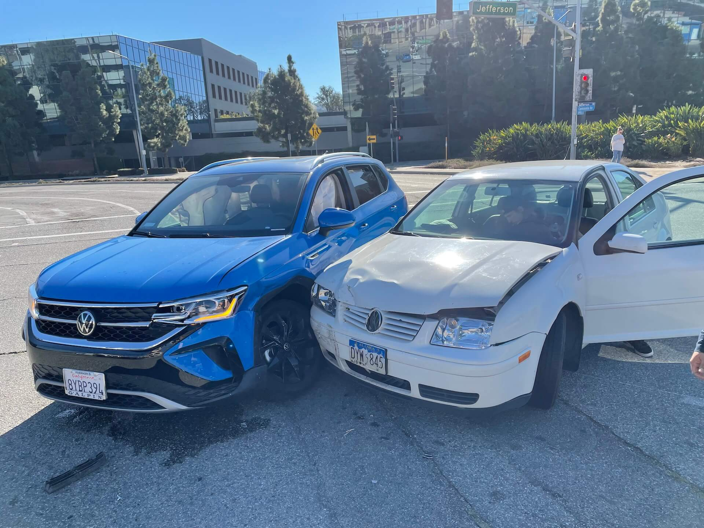

Няшмат хто ведае, што адбылося са мной ды аўтамабілем напрыканцы 2021га года. Некаторыя, як я даведаўся, наогул не ведалі, што аўтамабіль ёсць. А як яму не быць, калі тут, у Каліфорніі, на сваіх дзьвух ты можаш схадзіць калі што па пошту, ўсё астатнее - гэта нешта далекае.

Неяк у нядзелю я вырашыў папіць кавы, а каб было цікавей - зрабіць гэта у новым месцы. Знайсці яго не так і складана, калі захацець: мы тут ўсё ж людзі новыя, многа чаго не бачылі. Таму, пасля пяці хвілін пошуку, мне прывабілася адна кавярня, з карэйскім ухілам. Размяшчалася яна недалека, хвілін 7 ад дому, таму было вырашана “зацаніць” яе убранства. Але, недзе на на паўдарозе, здарылася гэта:

Уявіце сабе: вы збіраецеся павярнуць, і за момант да сутыкнення вы ўсё пачынаеце разумець, у тым ліку і тое, што нічога знабіць ужо нельга. 

> Думка, штуршок, незнаёмыя гукі. поўнае здранцвенне. 
>
> Так, здаецца, усё ў парадку.

Той хлопец быў у сваіх думках і не заўважыў, як паехаў на чырвоны. Пікап на левай паласе паспеў заўважыць гэта  (хоць і поздна) і адразу адтармазіўся, таму амель весь удар прыляцеў да мяне.

Я выразна помню ўсё, што здарылася апасля. З цікавага:
- Некалькі аўтамабілістаў спыніліся, каб запытать, ці усё добра, Адзін з іх падышоў да мяне, каб распытаць пра мой стан і расказаць, што я павінен рабіць. Ён сказаў: “Адразу спытай, ці ёсць у таго хлопца страхоўка. Калі няма - клічы копаў!”
- Хуткая ды копы прыехалі самі. Я думаю, нехта патэлефанаваў, ці машына адразу адправіла каардынаты. Спыталі, ці мы у парадку, зноўку спыталі пра страхоўкі.
- Міма праязджаў эвакуатаршчык, хутка адцягнуў машыну далей ад скрыжавання, патэлефанаваў свайму бацьку (эвакуатаршчыку!!!) і яны павезлі абодьзва аўтамабіля у майстэрню.

Каву я ўсе ж у той дзень папіў, але стан быў тады у рэжыме mixed feelings.

## Што рабіць, калi баліць?
Вось што я даведаўся пра паводзіны пасля ДТЗ:
- Трэба зрабіць фотаздымкі страхоўкі і праў другога чалавека, а таксама ўзяць яго тэлефонны нумер;
- Патэлефанаваць у сваю страхавую кампанію і рассказаць, што ды як адбылося. Паведаміць, калі табе нешта баліць альбо ёсць бачныя пашкоджанні. Пасля гэтага можна распачаць іск:
    -  У чужой страхавой, усе кошты будуць пакрыты ёй;
    -  У сваёй страхавой. Ты выплочваешь франшызу (грошы, якія страхавая кампанія артымлівае ад цябе у любым выпадку, калі нешта здараецца), але яны вярнуцца да цябе, калі аўтамабіль будзе выпраўлена і другая страхавая верне ўсе грошы першай.
- Калі аўто у лізінгу, трэба таксама патэлефанавась лізінгавай кампаніі і распавесці пра ДТЗ.
- Паведаміць ДАІ у 10-дзенны перыяд, калі сума пашкоджанняў больш за $1,000.

## Як справы?
Са здароўем усё добра, пашанцавала. З машынкай, але ж, атрымалася не так файна: шмат якіх дэталей не было дзе купіць. Не таму, што няма грошай (на дзіва, страхавая кампанія адправіла чэк у майстэрню на наступны дзень пасля ацэнкі пашкоджанняў) а таму што аўто было такім новенькім, што вытворца нават не пачаў вырабляць і пастаўляць дэталі як асобныя часткі. Гэта, уласна, і стала прычынай, чаму аўто не маглі паставіць ”на колы” на працягу пяці месяцаў. Нават зараз я чакаю адну дэталь салона, але ніхто не ведае, калі яна прыплыве. Што праўда, гэта не перашкаджае катацца. 

Як жа мы жылі без машыны? Гэта вельмі цікава, таму што першыя тры месяцы арэнду аўто аплочвала другая страхавая. Затым яны патэлефанавалі і сказалі, што ў іх скончыліся грошы па страхоўцы таго хлопца (што вельмі можа быць, калі страхоўка мінімальная, бо аднавіць аўто каштавала як палова новага), таму яны адправілі кейс да маёй. Мой поліс не імее безліміта на арэнду, таму арэнда падмены была аплачана на яшчё адзін месяц. Апошні, пяты месяц, было ужо цяжка, ратавалі сябры і убер. 

Схавацца ад такой сітуацыі немагчыма. Заўседы будуць фактары, ад якіх ты не залежыш. Таму не шкадуйце на страхоўцы, нават калі здаецца, что гэта грошы на вецер. Паскорыць рамонт можа пакупка вельмі папулярнай мадэлі, якая была выпушчана некалькі гадоў таму (пра шортадж мне тут хіба што мёртвы не казаў). 

Беражыце сябе!